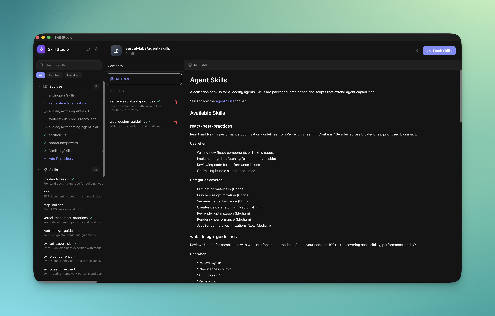

<p align="center">
  
</p>

<h1 align="center">Skill Studio</h1>

<p align="center">
  A desktop app to browse, fetch, and install <a href="https://docs.anthropic.com/en/docs/claude-code">Claude Code</a> skills.
</p>

## About

Skill Studio makes it easy to discover and manage skills for Claude Code. Skills are reusable prompts and instructions that extend Claude's capabilities in specific domains like SwiftUI development, React best practices, debugging, and more.

## Features

- **Browse Skills** - Explore curated skill repositories from the community
- **Preview Content** - Read skill documentation with full markdown rendering
- **One-Click Install** - Install skills via `npx skills add` or direct copy to `~/.claude/skills/`
- **Custom Repositories** - Add any GitHub repository containing Claude skills
- **Favorites** - Right-click to favorite skills and repos for quick access
- **Search & Filter** - Find skills by name, description, or filter by status

## Screenshot

<p align="center">
  
</p>

## Development

```bash
bun install
bun tauri dev
```

## Build

```bash
bun tauri build
```

## Tech Stack

- [Tauri 2.0](https://tauri.app/) - Desktop app framework
- [React](https://react.dev/) + [TypeScript](https://www.typescriptlang.org/)
- [Tailwind CSS](https://tailwindcss.com/) - Styling
- [Lucide](https://lucide.dev/) - Icons

## License

MIT
